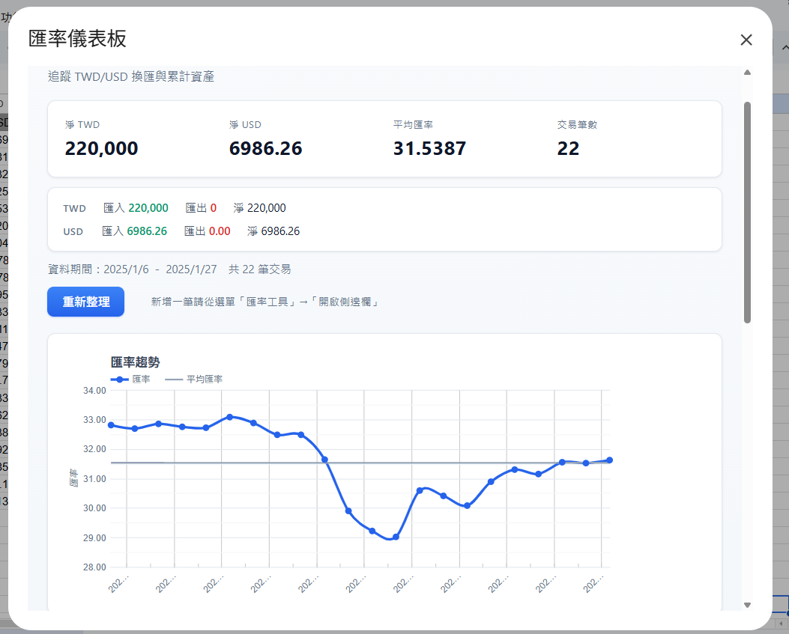
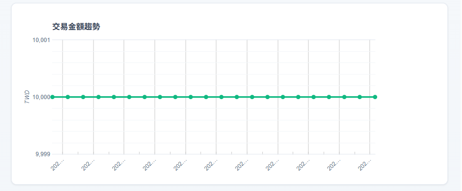
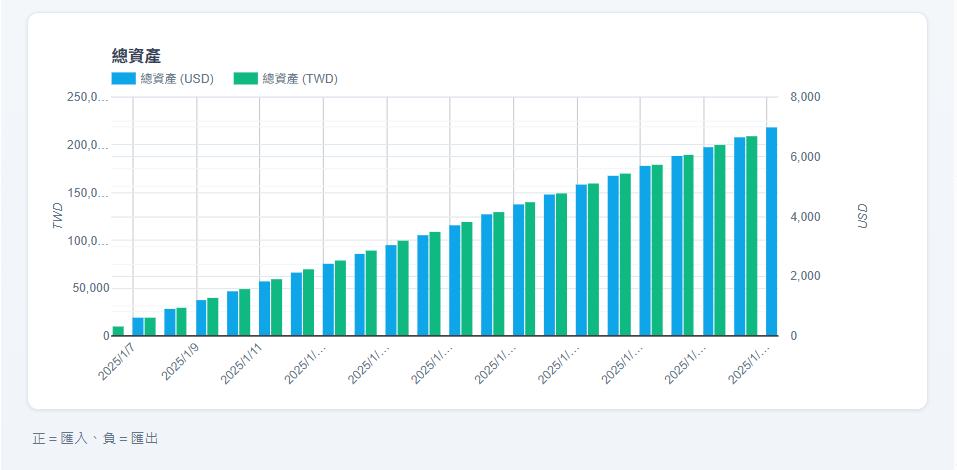
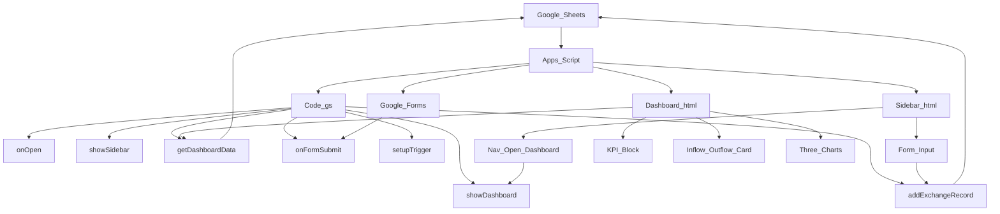
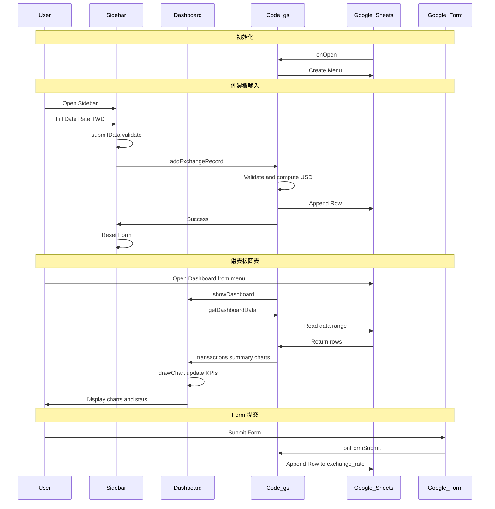
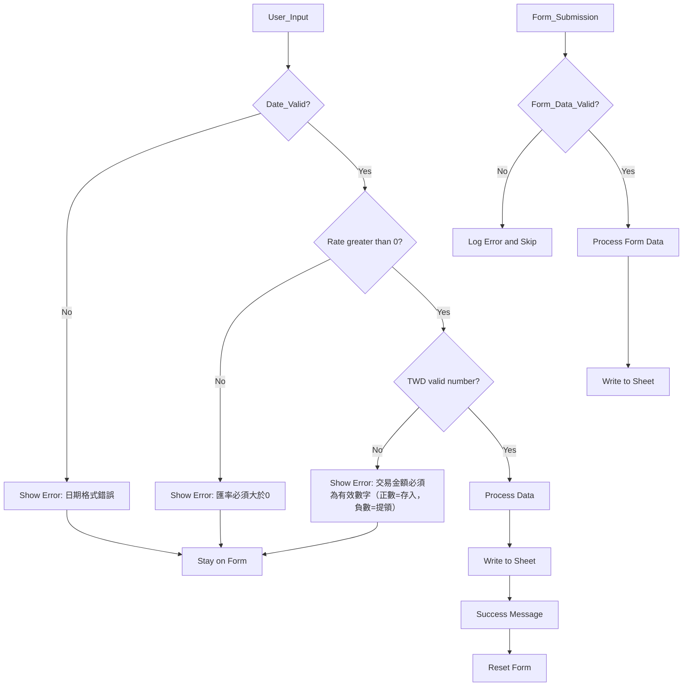

# Exchange Rate Dashboard (Google Apps Script)

> **A comprehensive exchange rate and transaction management tool built with Google Apps Script.**  
> Track TWD/USD exchange rates, manage transaction amounts, and visualize data with interactive charts. Suited for personal finance and currency exchange tracking.

這是一個使用 Google Apps Script 製作的匯率與交易金額管理工具。

## 功能特色

- **側邊欄輸入**：由選單「匯率工具」→「開啟側邊欄」輸入日期、匯率與 TWD 金額，寫入 Google 試算表。
- **自動計算 USD**：USD = TWD ÷ 匯率，由系統自動計算並寫入。
- **儀表板圖表**：由選單「匯率工具」→「開啟儀表板」在彈出視窗中檢視匯率與交易金額圖表及統計（圖表與摘要均在儀表板，不在側邊欄）。
- **輸入驗證**：日期、匯率、TWD 金額具備基本防呆；支援正數（匯入）與負數（匯出）。
- **統計功能**：儀表板顯示淨 TWD、淨 USD、平均匯率、交易筆數，以及流入/流出摘要。
- **Google Form 整合**：可透過 Google Form 提交資料；設定觸發器後自動寫入試算表（寫入工作表 `exchange_rate`）。

## 系統截圖

### 側邊欄（資料輸入）

  
   
  <em>側邊欄介面 — 新增換匯紀錄、開啟儀表板、說明</em>

### 儀表板（圖表與統計）

  
   
  <em>儀表板總覽 — KPI 與流入/流出</em>

  
   
  <em>匯率與交易金額圖表</em>

  
   
  <em>總資產圖表 (USD / TWD)</em>

## 使用方式

### 步驟 1：設定 Google Apps Script

1. 開啟你的 Google 試算表。
2. 選單「擴充功能」→「Apps Script」，進入編輯器。
3. 新增三個檔案並貼上對應程式碼：
   - `Code.gs` — 主程式
   - `Sidebar.html` — 側邊欄介面
   - `Dashboard.html` — 儀表板介面
4. 儲存後回到試算表並重新整理。

### 步驟 2：使用側邊欄與儀表板

5. 選單「匯率工具」→「開啟側邊欄」：在側邊欄輸入日期、匯率、TWD 金額並儲存。
6. 選單「匯率工具」→「開啟儀表板」：在彈出視窗中查看圖表與統計；可點「重新整理」更新資料。

### 步驟 3：Google Form 整合（選用）

7. 建立 Google Form，欄位包含：交易日期（日期）、匯率（數字）、TWD 金額（數字）。
8. 在 Apps Script 編輯器執行 `setupTrigger()` 設定觸發器。
9. Form 提交後會自動寫入試算表；寫入目標為工作表名稱 `exchange_rate`。

## 未來可擴充功能

- 日期區間過濾
- 多幣種匯率比較
- 即時 API 串接
- 匯率波動與預測
- 統計分析報表
- 匯率變動通知
- 行動裝置優化
- 資料加密與權限管理

## 系統架構

### 技術架構

- **前端**：Sidebar.html（側邊欄）、Dashboard.html（儀表板彈窗）、HTML + JavaScript + Google Charts
- **後端**：Google Apps Script（Code.gs）
- **資料**：Google Sheets
- **圖表**：Google Charts（於 Dashboard 中載入）
- **表單**：Google Forms + 觸發器（選用）

### 系統流程圖

### 資料流程圖

### 錯誤處理流程

## Google Sheet 範例格式

試算表至少需有前四欄（第 1 列為標題）：

| Timestamps | Rate  | TWD   | USD   |
|------------|-------|-------|--------|
| 2025/01/07 | 32.82 | 20000 | 609.38 |
| 2025/01/22 | 32.70 | 5000  | 152.91 |
| 2025/02/12 | 32.86 | 15000 | 456.48 |

### 欄位說明

- **Timestamps**：交易日期（建議日期格式，如 yyyy/mm/dd）。
- **Rate**：當日匯率（TWD/USD）。
- **TWD**：交易新台幣金額（正數＝匯入，負數＝匯出）。
- **USD**：由系統自動計算（TWD ÷ Rate）。

儀表板由 `getDashboardData()` 讀取「使用中工作表」的資料範圍，並依前四欄計算統計與圖表，不需另外填寫 Total TWD / Total USD / Average 欄位。

## 進階設定

### Google Form 觸發器

- 在 Apps Script 編輯器執行 `setupTrigger()` 可建立 Form 提交觸發器。
- Form 寫入的目標工作表名稱為 `exchange_rate`（需在試算表內有此工作表）。
- 側邊欄與儀表板讀寫的對象為「使用中的工作表」（active sheet）。

### 重設觸發器

執行 `resetFormSubmitTrigger()` 可刪除並重新建立 `onFormSubmit` 觸發器。

## 程式碼結構

### Code.gs

- `onOpen()`：建立選單「匯率工具」。
- `showSidebar()`：顯示側邊欄（Sidebar.html）。
- `showDashboard()`：顯示儀表板彈窗（Dashboard.html）。
- `getDashboardData()`：回傳交易列表、摘要、流入/流出、圖表用資料（供 Dashboard 使用）。
- `addExchangeRecord(dateStr, rate, twd)`：驗證並寫入一筆紀錄（供 Sidebar 使用）。
- `onFormSubmit(e)`：處理 Form 提交事件。
- `setupTrigger()`：建立 Form 提交觸發器。
- `resetFormSubmitTrigger()`：重設 Form 觸發器。

### Sidebar.html

- 資料輸入表單（日期、匯率、TWD）。
- 導航：新增換匯、開啟儀表板、說明。
- 表單收合與說明區塊。

### Dashboard.html

- KPI 區塊：淨 TWD、淨 USD、平均匯率、交易筆數。
- 流入/流出卡片。
- 三張圖表：匯率與平均匯率、交易金額 TWD、總資產 USD/TWD。
- 重新整理按鈕。

## 常見問題

**Q: 圖表在哪裡？**  
A: 請由選單「匯率工具」→「開啟儀表板」查看圖表與統計。

**Q: 如何設定 Google Form 整合？**  
A: 建立 Google Form 後，在 Apps Script 編輯器執行 `setupTrigger()`。Form 會寫入工作表 `exchange_rate`。

**Q: 統計或圖表沒有顯示？**  
A: 儀表板資料來自「使用中的工作表」。請確認該工作表前四欄（日期、Rate、TWD、USD）有資料，且第 1 列為標題。

**Q: 圖表無法顯示？**  
A: 請確認網路連線正常，且 Google Charts 可載入（Dashboard 內已引用 loader.js）。

**Q: 資料驗證失敗？**  
A: 日期請用 yyyy-mm-dd；匯率須大於 0；TWD 須為有效數字（正數＝存入，負數＝提領）。
