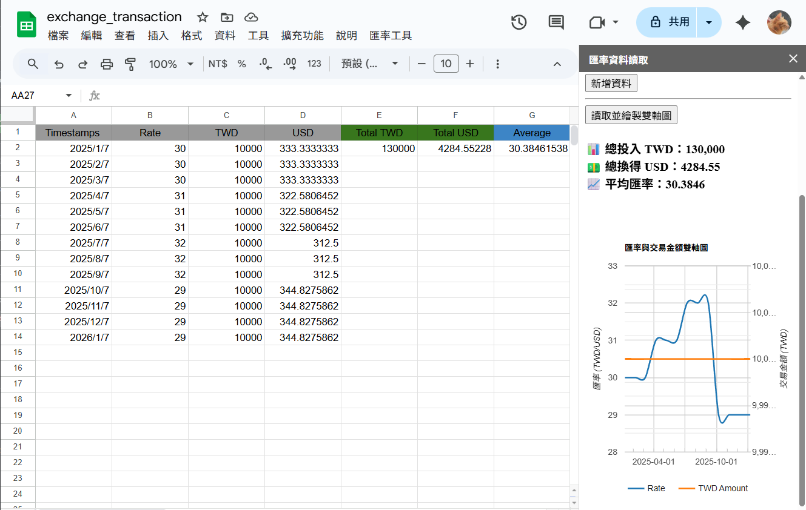
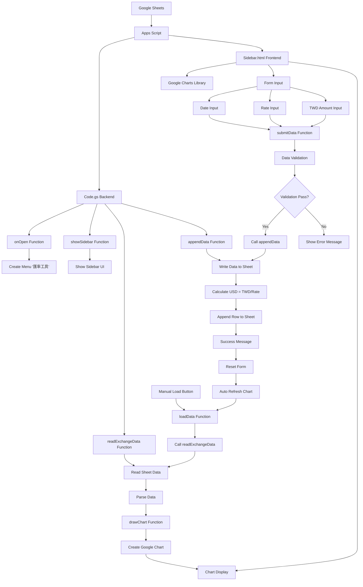
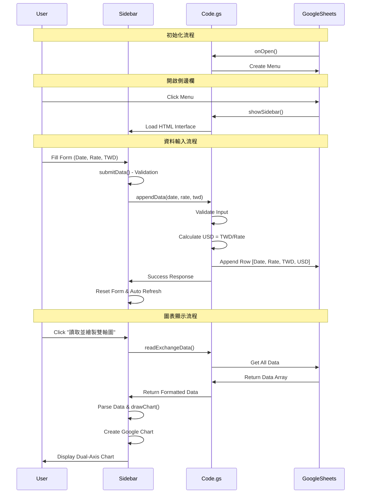
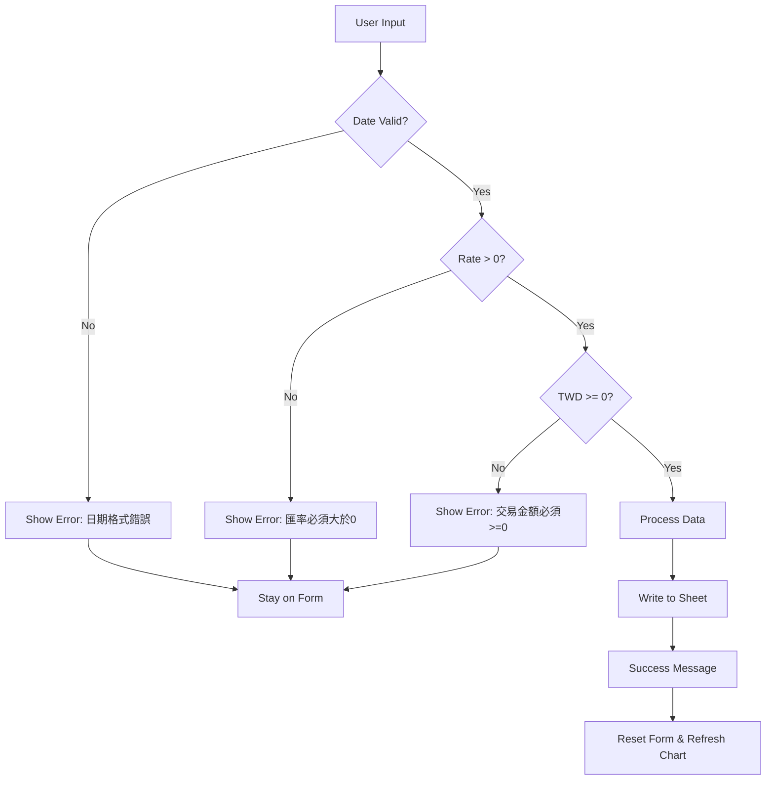

# Exchange Rate Dashboard (Google Apps Script)

> 📊 **A comprehensive exchange rate and transaction management tool built with Google Apps Script**  
> Track TWD/USD exchange rates, manage transaction amounts, and visualize data with interactive dual-axis charts. Perfect for personal finance tracking and currency exchange monitoring.

這是一個使用 Google Apps Script 製作的匯率與交易金額管理工具。

## 📋 功能特色

- ✅ 在側邊欄輸入日期、匯率與 TWD 交易金額，並寫入 Google 試算表
- ✅ 自動計算 USD 金額（TWD / 匯率）
- ✅ 讀取試算表資料並用 Google Charts 繪製匯率與交易金額的雙軸折線圖
- ✅ 輸入資料具備基本防呆檢查
- ✅ 日期欄格式固定只顯示年月日
- ✅ 即時圖表更新和表單重置

## 📸 系統截圖

  
   
  <em>匯率儀表板系統介面 - 支援資料輸入與雙軸圖表顯示</em>

## 🚀 使用方式

### 步驟 1: 設定 Google Apps Script
1. 開啟你的 Google 試算表
2. 點選上方選單「擴充功能」→「Apps Script」，進入 Apps Script 編輯器
3. 在 Apps Script 編輯器中：
   - 新增一個檔案，命名為 `Code.gs`，將主程式碼貼上
   - 新增一個檔案，命名為 `Sidebar.html`，將前端程式碼貼上
4. 儲存所有檔案，然後回到 Google 試算表並重新整理頁面

### 步驟 2: 使用系統
5. 你會在試算表上方看到新的選單「匯率工具」，點選「開啟側邊欄」
6. 在側邊欄即可輸入資料，或點擊按鈕查看匯率與交易金額的雙軸圖表

## 🔮 未來可擴充功能

- 📅 日期區間過濾
- 🌍 多幣種匯率比較
- 🔄 即時 API 串接更新
- 📈 匯率波動率與預測
- 📊 統計分析報表
- 🔔 匯率變動通知

## 🏗️ 系統架構

### 技術架構
- **前端**: HTML + JavaScript + Google Charts
- **後端**: Google Apps Script (Code.gs)
- **資料庫**: Google Sheets
- **圖表**: Google Charts Library

### 系統流程圖

### 資料流程圖

### 錯誤處理流程

## 📊 Google Sheet 範例格式

請在 Google 試算表中建立如下表格結構（第 1 列為標題）：

| Timestamps | Rate  | TWD   | USD   | Total TWD | Total USD | Average |
|------------|-------|-------|--------|-----------|-----------|---------|
| 2025/01/07 | 32.82 | 20000 | 609.38 | 210000    | 6565.33   | 32.05   |
| 2025/01/22 | 32.70 | 5000  | 152.91 |           |           |         |
| 2025/02/12 | 32.86 | 15000 | 456.48 |           |           |         |
| ...        | ...   | ...   | ...    |           |           |         |

### 欄位說明

- `Timestamps`：交易日期（格式建議為 `yyyy/mm/dd`，可將儲存格設為「日期格式」）
- `Rate`：當日匯率（TWD/USD）
- `TWD`：交易的新台幣金額
- `USD`：由系統自動計算（TWD ÷ Rate）
- `Total TWD`, `Total USD`, `Average`：選填欄位，可用來顯示統計資料

🔸 *由側邊欄輸入資料時，系統會自動寫入 `Timestamps`, `Rate`, `TWD`，並自動計算 `USD` 欄位。*
