# Exchange Rate Dashboard (Google Apps Script)

> 📊 **A comprehensive exchange rate and transaction management tool built with Google Apps Script**  
> Track TWD/USD exchange rates, manage transaction amounts, and visualize data with interactive dual-axis charts. Perfect for personal finance tracking and currency exchange monitoring.

這是一個使用 Google Apps Script 製作的匯率與交易金額管理工具。

## 📋 功能特色

- ✅ 在側邊欄輸入日期、匯率與 TWD 交易金額，並寫入 Google 試算表
- ✅ 自動計算 USD 金額（TWD / 匯率）
- ✅ 讀取試算表資料並用 Google Charts 繪製匯率與交易金額的雙軸折線圖
- ✅ 輸入資料具備基本防呆檢查
- ✅ 日期欄格式固定只顯示年月日
- ✅ 即時圖表更新和表單重置
- ✅ **Google Form 整合** - 支援透過 Google Form 提交資料
- ✅ **統計功能** - 顯示總投入 TWD、總換得 USD、平均匯率
- ✅ **自動觸發器** - 設定 Form 提交自動處理

## 📸 系統截圖

<div align="center">
  
  <br>
  <em>匯率儀表板系統介面 - 支援資料輸入與雙軸圖表顯示</em>
</div>

## 🚀 使用方式

### 步驟 1: 設定 Google Apps Script
1. 開啟你的 Google 試算表
2. 點選上方選單「擴充功能」→「Apps Script」，進入 Apps Script 編輯器
3. 在 Apps Script 編輯器中：
   - 新增一個檔案，命名為 `Code.gs`，將主程式碼貼上
   - 新增一個檔案，命名為 `Sidebar.html`，將前端程式碼貼上
4. 儲存所有檔案，然後回到 Google 試算表並重新整理頁面

### 步驟 2: 使用側邊欄功能
5. 你會在試算表上方看到新的選單「匯率工具」，點選「開啟側邊欄」
6. 在側邊欄即可輸入資料，或點擊按鈕查看匯率與交易金額的雙軸圖表

### 步驟 3: 設定 Google Form 整合（選用）
7. 建立 Google Form 包含以下欄位：
   - 交易日期（日期類型）
   - 匯率（數字類型）
   - TWD 金額（數字類型）
8. 在 Apps Script 編輯器中執行 `setupTrigger()` 函數
9. 設定觸發器後，Form 提交會自動處理並寫入試算表

## 🔮 未來可擴充功能

- 📅 日期區間過濾
- 🌍 多幣種匯率比較
- 🔄 即時 API 串接更新
- 📈 匯率波動率與預測
- 📊 統計分析報表
- 🔔 匯率變動通知
- 📱 行動裝置優化
- 🔐 資料加密與權限管理

## 🏗️ 系統架構

### 技術架構
- **前端**: HTML + JavaScript + Google Charts
- **後端**: Google Apps Script (Code.gs)
- **資料庫**: Google Sheets
- **圖表**: Google Charts Library
- **表單整合**: Google Forms + Triggers

### 系統流程圖

```mermaid
graph TD
    %% 主要系統組件
    A[📊 Google Sheets] --> B[⚙️ Apps Script]
    B --> C[🔧 Code.gs Backend]
    B --> D[🎨 Sidebar.html Frontend]
    B --> E[📝 Google Forms]
    
    %% 後端功能模組
    C --> F[🏠 onOpen Function]
    C --> G[📋 showSidebar Function]
    C --> H[📖 readExchangeData Function]
    C --> I[➕ appendData Function]
    C --> J[📊 getSummaryStats Function]
    C --> K[📤 onFormSubmit Function]
    C --> L[🔗 setupTrigger Function]
    
    %% 前端功能模組
    D --> M[📈 Google Charts Library]
    D --> N[📝 Form Input]
    D --> O[📊 Chart Display]
    D --> P[📋 Summary Display]
    
    %% Form 整合
    E --> Q[📤 Form Submission]
    Q --> K
    
    %% 功能實現
    F --> R[🎯 Create Menu '匯率工具']
    G --> S[🖥️ Show Sidebar UI]
    H --> T[📖 Read Sheet Data]
    I --> U[✍️ Write Data to Sheet]
    J --> V[📊 Get Summary Statistics]
    K --> W[⚙️ Process Form Data]
    L --> X[🔗 Setup Form Trigger]
    
    %% 資料輸入流程
    N --> Y[📅 Date Input]
    N --> Z[💱 Rate Input]
    N --> AA[💰 TWD Amount Input]
    
    Y --> BB[📤 submitData Function]
    Z --> BB
    AA --> BB
    
    %% 驗證流程
    BB --> CC[✅ Data Validation]
    CC --> DD{❓ Validation Pass?}
    DD -->|✅ Yes| EE[📞 Call appendData]
    DD -->|❌ No| FF[⚠️ Show Error Message]
    
    %% 資料處理流程
    EE --> U
    U --> GG[🧮 Calculate USD = TWD/Rate]
    GG --> HH[📝 Append Row to Sheet]
    HH --> II[✅ Success Message]
    II --> JJ[🔄 Reset Form]
    JJ --> KK[🔄 Auto Refresh Chart]
    
    %% 圖表更新流程
    KK --> LL[📊 loadData Function]
    LL --> MM[📞 Call readExchangeData]
    LL --> NN[📞 Call getSummaryStats]
    MM --> T
    NN --> V
    T --> OO[🔍 Parse Data]
    V --> PP[📋 Update Summary Display]
    OO --> QQ[📈 drawChart Function]
    QQ --> RR[🎨 Create Google Chart]
    RR --> O
    
    %% 手動載入
    SS[🔄 Manual Load Button] --> LL
    
    %% 樣式設定
    classDef systemComponent fill:#e1f5fe,stroke:#01579b,stroke-width:2px
    classDef backendFunction fill:#f3e5f5,stroke:#4a148c,stroke-width:2px
    classDef frontendFunction fill:#e8f5e8,stroke:#1b5e20,stroke-width:2px
    classDef dataFlow fill:#fff3e0,stroke:#e65100,stroke-width:2px
    classDef validationNode fill:#ffebee,stroke:#c62828,stroke-width:2px
    classDef chartNode fill:#f1f8e9,stroke:#33691e,stroke-width:2px
    
    class A,B systemComponent
    class C,F,G,H,I,J,K,L backendFunction
    class D,M,N,O,P frontendFunction
    class Y,Z,AA,BB,CC,DD,EE,FF,GG,HH,II,JJ,KK dataFlow
    class DD validationNode
    class LL,MM,NN,OO,PP,QQ,RR chartNode
```



### 資料流程圖

```mermaid
sequenceDiagram
    participant User as 👤 User
    participant Sidebar as 🎨 Sidebar
    participant Code.gs as 🔧 Code.gs
    participant GoogleSheets as 📊 GoogleSheets
    participant GoogleForm as 📝 GoogleForm
    
    Note over User,GoogleForm: 🚀 初始化流程
    GoogleSheets->>Code.gs: 📞 onOpen()
    Code.gs->>GoogleSheets: 🎯 Create Menu
    
    Note over User,GoogleForm: 📋 開啟側邊欄
    User->>GoogleSheets: 🖱️ Click Menu
    GoogleSheets->>Code.gs: 📞 showSidebar()
    Code.gs->>Sidebar: 🎨 Load HTML Interface
    
    Note over User,GoogleForm: 📝 側邊欄資料輸入流程
    User->>Sidebar: 📝 Fill Form (Date, Rate, TWD)
    Sidebar->>Sidebar: ✅ submitData() - Validation
    Sidebar->>Code.gs: 📤 appendData(date, rate, twd)
    Code.gs->>Code.gs: 🔍 Validate Input
    Code.gs->>Code.gs: 🧮 Calculate USD = TWD/Rate
    Code.gs->>GoogleSheets: 📝 Append Row [Date, Rate, TWD, USD]
    Code.gs->>Sidebar: ✅ Success Response
    Sidebar->>Sidebar: 🔄 Reset Form & Auto Refresh
    
    Note over User,GoogleForm: 📤 Google Form 提交流程
    User->>GoogleForm: 📤 Submit Form Data
    GoogleForm->>Code.gs: 📤 onFormSubmit(formData)
    Code.gs->>Code.gs: 🔍 Validate Form Data
    Code.gs->>Code.gs: 🧮 Calculate USD = TWD/Rate
    Code.gs->>GoogleSheets: 📝 Append Row [Date, Rate, TWD, USD]
    
    Note over User,GoogleForm: 📊 圖表顯示流程
    User->>Sidebar: 🖱️ Click "讀取並繪製雙軸圖"
    Sidebar->>Code.gs: 📞 readExchangeData()
    Sidebar->>Code.gs: 📞 getSummaryStats()
    Code.gs->>GoogleSheets: 📖 Get All Data
    Code.gs->>GoogleSheets: 📊 Get Summary Data
    GoogleSheets->>Code.gs: 📄 Return Data Arrays
    Code.gs->>Sidebar: 📄 Return Formatted Data
    Sidebar->>Sidebar: 🔍 Parse Data & drawChart()
    Sidebar->>Sidebar: 🎨 Create Google Chart
    Sidebar->>Sidebar: 📋 Update Summary Display
    Sidebar->>User: 📊 Display Dual-Axis Chart & Stats
```



### 錯誤處理流程

```mermaid
flowchart TD
    %% 主要輸入驗證流程
    A[📝 User Input] --> B{❓ Date Valid?}
    B -->|❌ No| C[⚠️ Show Error: 日期格式錯誤]
    B -->|✅ Yes| D{❓ Rate > 0?}
    D -->|❌ No| E[⚠️ Show Error: 匯率必須大於0]
    D -->|✅ Yes| F{❓ TWD >= 0?}
    F -->|❌ No| G[⚠️ Show Error: 交易金額必須>=0]
    F -->|✅ Yes| H[⚙️ Process Data]
    H --> I[📝 Write to Sheet]
    I --> J[✅ Success Message]
    
    %% 錯誤處理分支
    C --> K[🔄 Stay on Form]
    E --> K
    G --> K
    J --> L[🔄 Reset Form & Refresh Chart]
    
    %% Form 提交驗證流程
    M[📤 Form Submission] --> N{❓ Form Data Valid?}
    N -->|❌ No| O[📝 Log Error & Skip]
    N -->|✅ Yes| P[⚙️ Process Form Data]
    P --> Q[📝 Write to Sheet]
    
    %% 樣式設定
    classDef inputNode fill:#e3f2fd,stroke:#1976d2,stroke-width:2px
    classDef validationNode fill:#fff3e0,stroke:#f57c00,stroke-width:2px
    classDef errorNode fill:#ffebee,stroke:#d32f2f,stroke-width:2px
    classDef successNode fill:#e8f5e9,stroke:#388e3c,stroke-width:2px
    classDef processNode fill:#f3e5f5,stroke:#7b1fa2,stroke-width:2px
    
    class A inputNode
    class B,D,F,N validationNode
    class C,E,G,O errorNode
    class J successNode
    class H,P processNode
```



## 📊 Google Sheet 範例格式

請在 Google 試算表中建立如下表格結構（第 1 列為標題）：

| Timestamps | Rate  | TWD   | USD   | Total TWD | Total USD | Average |
|------------|-------|-------|--------|-----------|-----------|---------|
| 2025/01/07 | 32.82 | 20000 | 609.38 | 210000    | 6565.33   | 32.05   |
| 2025/01/22 | 32.70 | 5000  | 152.91 |           |           |         |
| 2025/02/12 | 32.86 | 15000 | 456.48 |           |           |         |
| ...        | ...   | ...   | ...    |           |           |         |

### 欄位說明

- `Timestamps`：交易日期（格式建議為 `yyyy/mm/dd`，可將儲存格設為「日期格式」）
- `Rate`：當日匯率（TWD/USD）
- `TWD`：交易的新台幣金額
- `USD`：由系統自動計算（TWD ÷ Rate）
- `Total TWD`, `Total USD`, `Average`：統計欄位，用於顯示累計資料

🔸 *由側邊欄或 Google Form 輸入資料時，系統會自動寫入 `Timestamps`, `Rate`, `TWD`，並自動計算 `USD` 欄位。*

## 🔧 進階設定

### Google Form 觸發器設定
```javascript
// 在 Apps Script 編輯器中執行以下函數來設定觸發器
function setupTrigger() {
  // 自動設定 Form 提交觸發器
}
```

### 統計資料讀取
系統會自動從試算表的第 2 列第 5-7 欄讀取統計資料：
- 第 5 欄：Total TWD
- 第 6 欄：Total USD  
- 第 7 欄：Average Rate

## 📝 程式碼結構

### Code.gs 主要函數
- `onOpen()`: 建立選單介面
- `showSidebar()`: 顯示側邊欄
- `readExchangeData()`: 讀取匯率資料
- `appendData()`: 新增交易記錄
- `getSummaryStats()`: 讀取統計資料
- `onFormSubmit()`: 處理 Form 提交
- `setupTrigger()`: 設定 Form 觸發器

### Sidebar.html 主要功能
- 資料輸入表單
- Google Charts 圖表顯示
- 統計資料顯示
- 即時資料更新

## 🐛 常見問題

**Q: 如何設定 Google Form 整合？**
A: 建立 Google Form 後，在 Apps Script 編輯器中執行 `setupTrigger()` 函數即可。

**Q: 統計資料沒有顯示？**
A: 請確認試算表第 2 列第 5-7 欄有填入統計資料。

**Q: 圖表無法顯示？**
A: 請確認已載入 Google Charts 函式庫，並檢查網路連線。

**Q: 資料驗證失敗？**
A: 請確認日期格式為 yyyy-mm-dd，匯率為正數，TWD 金額為非負數。
